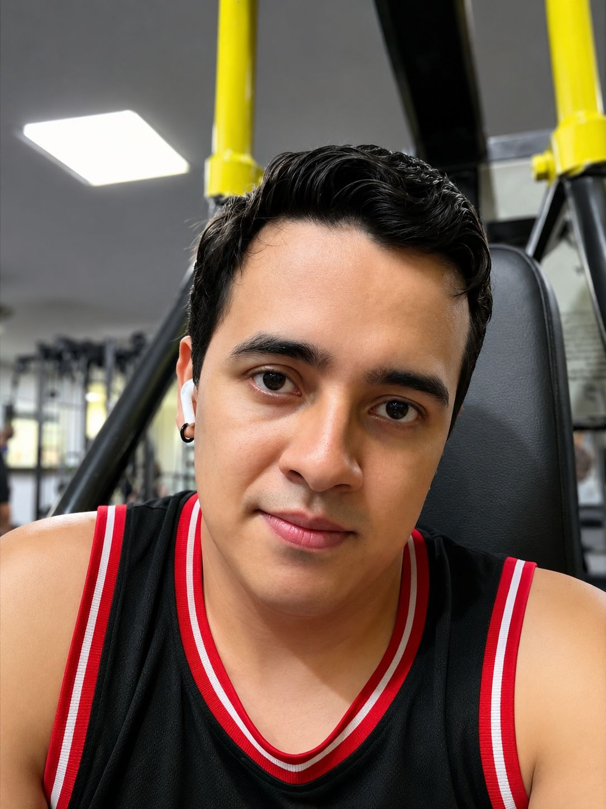
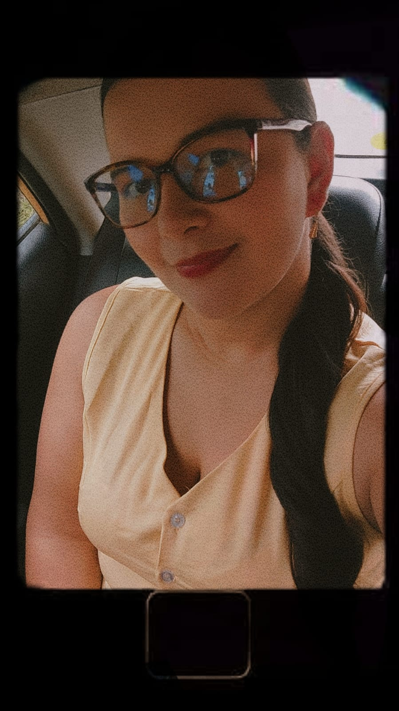

# PIXEL-CODERS

## Paula Andrea Zambrano Meneses

- **Rol en la industria:** [probador de juegos de control de calidad QA tester]
- **Ubicacion:** Libano,Tolima,Colombia
- **Perfil:** [Estudiante de Ing.multimedia, pertenezco a la unad.Me apaciona toda la parte de creacion ya sea paginas webs o la parte de multimedia] 

## Nicolas David Dussan Quiroga

- **Rol en la industria:** [Diseñador de juegos]
- **Ubicacion:** Neiva,Huila,Colombia
- **Perfil:** [Soy estudiante de Ingenieria Multimedia en la UNAD, con conocimientos en diseño grafico y nociones basicas de programacion. Me apasionan los viajes, la creatividad y el desarrollo de proyectos digitales que me permitan seguir fortaleciendo mis habilidades]

# Dorany Alvarez Nuñez

- **Rol en la industria:** [Programador de Videojuego]
- **ubicacion:** Florencia, Caqueta, Colombia
- **Perfil:** [Soy estudiante Ingenieria de Multimedia en la UNAD, me apasiona la pintura, y con base de programacion de videojuego me interesa la logica de juego y la programacion de mecanica interactiva]

### mi plato favorito

- [Brenda Melissa Rojas Vidal](melissa/README.md)

